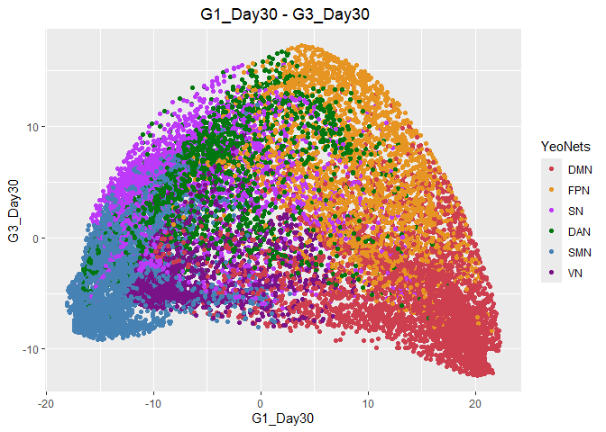
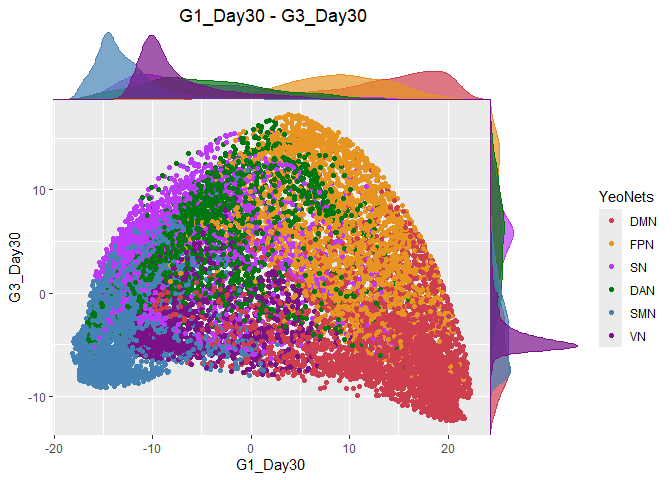

Figure 1 Yeo Networks Gradients Cloud
================

Import Required Packages

``` r
library(ggsci)
library(cowplot)
library(ggthemes)
library(ggridges)
library(philentropy)
library(dplyr)
library(ggplot2)
library(ggpubr)
library(psych)
library(ICC)
library(lattice)
library(lpSolve)
library(irr)
library(plot.matrix)
library(reshape)
library(plotly)
library(tidyverse)
library(svglite)
library(cowplot) 
```

Load Gradients (G1,G2,G3) Data

``` r
G1 = read.csv('../Brainspace/G1_results_BS_p_20K_20K_Dan.csv')
unique_names = unique(G1$YeoNets)
G1$YeoNets = factor(G1$YeoNets, levels = unique_names)

G2 = read.csv('../Brainspace/G2_results_BS_p_20K_20K_Dan.csv')
unique_names = unique(G2$YeoNets)
G2$YeoNets = factor(G2$YeoNets, levels = unique_names)

G3 = read.csv('../Brainspace/G3_results_BS_p_20K_20K_Dan.csv')
unique_names = unique(G3$YeoNets)
G3$YeoNets = factor(G3$YeoNets, levels = unique_names)
```

Prepare Data

``` r
# Define a function to filter and set factor levels for the YeoNets column
prepare_data <- function(data) {
  data %>%
    filter(YeoNets != 'LN') %>%
    mutate(YeoNets = factor(YeoNets, levels = c('DMN', 'FPN', 'SN', 'DAN', 'SMN', 'VN')))
}


calculate_all_day_means <- function(data, data_g2, data_g3) {
  data %>%
    mutate(
      # Calculate row means for G1 (columns 2-31, 32-61, 62-91)
      G1_Day1 = rowMeans(.[, 2:31]),
      G1_Day3 = rowMeans(.[, 32:61]),
      G1_Day30 = rowMeans(.[, 62:91]),
      
      # Calculate row means for G2 (columns 2-31, 32-61, 62-91 in data_g2)
      G2_Day1 = rowMeans(data_g2[, 2:31]),
      G2_Day3 = rowMeans(data_g2[, 32:61]),
      G2_Day30 = rowMeans(data_g2[, 62:91]),
      
      # Calculate row means for G3 (columns 2-31, 32-61, 62-91 in data_g3)
      G3_Day1 = rowMeans(data_g3[, 2:31]),
      G3_Day3 = rowMeans(data_g3[, 32:61]),
      G3_Day30 = rowMeans(data_g3[, 62:91])
    )
}

# Apply the function to the filtered data
```

Split the data, and create average per gradient per sessions

``` r
# Apply the function to each dataset
g1_filtered <- prepare_data(G1)
g2_filtered <- prepare_data(G2)
g3_filtered <- prepare_data(G3)  

data <- calculate_all_day_means(g1_filtered, g2_filtered, g3_filtered)
```

Gradient Cloud Plots

Gradient 1 vs Gradient 3 (For each sensstion (Day1/ Day3/ Day30))

``` r
filteredData<- data %>% filter(YeoNets == 'DMN' | YeoNets == 'SMN')
# Main plot
pmain <- ggplot(data,aes(G1_Day30,G3_Day30,color=YeoNets,fill=YeoNets))+
  geom_point()+
  ggpubr::color_palette(c('#CD3E4E','#E69422', '#BE3AFA', '#00760E', '#4682B4', '#781286'))+
  labs(title = " G1_Day30 - G3_Day30", x = "G1_Day30", y = "G3_Day30")+
  theme(plot.title = element_text(hjust = 0.5))
pmain
```

<!-- -->

``` r
# Marginal densities along x axis
xdens <- axis_canvas(pmain, axis = "x")+
  geom_density(data= data,aes(G1_Day30,color=YeoNets,fill=YeoNets),alpha = 0.7, size = 0.2)+
  ggpubr::fill_palette(c('#CD3E4E','#E69422', '#BE3AFA', '#00760E', '#4682B4', '#781286'))+
  ggpubr::color_palette(c('#CD3E4E','#E69422', '#BE3AFA', '#00760E', '#4682B4', '#781286'))
```

    ## Warning: Using `size` aesthetic for lines was deprecated in ggplot2 3.4.0.
    ## ℹ Please use `linewidth` instead.
    ## This warning is displayed once every 8 hours.
    ## Call `lifecycle::last_lifecycle_warnings()` to see where this warning was
    ## generated.

``` r
# Marginal densities along y axis
# Need to set coord_flip = TRUE, if you plan to use coord_flip()
ydens <- axis_canvas(pmain, axis = "y", coord_flip = TRUE)+
  geom_density(data=data,aes(G3_Day30,color=YeoNets,fill=YeoNets),
                alpha = 0.7, size = 0.2)+
  coord_flip()+
  ggpubr::fill_palette(c('#CD3E4E','#E69422', '#BE3AFA', '#00760E', '#4682B4', '#781286'))+
  ggpubr::color_palette(c('#CD3E4E','#E69422', '#BE3AFA', '#00760E', '#4682B4', '#781286'))
p1 <- insert_xaxis_grob(pmain, xdens, grid::unit(.2, "null"), position = "top")

p2<- insert_yaxis_grob(p1, ydens, grid::unit(.2, "null"), position = "right")
ggdraw(p2)
```

<!-- -->

``` r
# Reshape data to a long format to make it easier to plot Day 3 and Day 30 together
df_long <- data %>%
  pivot_longer(cols = starts_with("G"), names_to = "Gradient_Day", values_to = "Value") %>%
  separate(Gradient_Day, into = c("Gradient", "Day"), sep = "_")

# Filter for G1 and G3 gradients only, and reshape to wide format for plotting
df_filtered <- df_long %>%
  filter(Gradient %in% c("G1","G2", "G3")) %>%
  pivot_wider(names_from = "Gradient", values_from = "Value")
```

``` r
G1$G1_Subj11_Day1 <- G1$sub.11.ses.1
G1$G1_Subj11_Day3 <- G1$sub.11.ses.2
G1$G1_Subj11_Day30 <- G1$sub.11.ses.3


G1$G2_Subj11_Day1 <- G2$sub.11.ses.1
G1$G2_Subj11_Day3 <- G2$sub.11.ses.2
G1$G2_Subj11_Day30 <- G2$sub.11.ses.3


G1$G3_Subj11_Day1 <- G3$sub.11.ses.1
G1$G3_Subj11_Day3 <- G3$sub.11.ses.2
G1$G3_Subj11_Day30 <- G3$sub.11.ses.3
```

``` r
# Load necessary libraries
library(ggplot2)
library(tidyr)

# Assuming your data has columns for Day10, Day20, and Day30:
# Reshape data to long format
longData <- G1 %>%
  pivot_longer(
    cols = starts_with("G1_Subj11_Day"), # Assuming columns like G1_Subj11_Day10, G1_Subj11_Day20, G1_Subj11_Day30
    names_to = "Day",
    values_to = "G1_subj11"
  ) %>%
  mutate(
    G3_subj11 = case_when(
      Day == "G1_Subj11_Day1" ~ G3_Subj11_Day1,
      Day == "G1_Subj11_Day3" ~ G3_Subj11_Day3,
      Day == "G1_Subj11_Day30" ~ G3_Subj11_Day30
    ),
    Day = gsub("G1_Subj11_", "", Day)  # Extract just the day part for labeling
  )
```

``` r
longData <- longData %>% filter(YeoNets != 'LN')
p <- ggplot(longData, aes(x = G1_subj11, y = G3_subj11, color = YeoNets)) +
  geom_point(alpha = 0.7) +
  labs(title = "Comparison Across Days for Subject 11", x = "G1", y = "G3") +
  theme_minimal() +
  scale_fill_manual(values = c('#00760E','#E69422', '#CD3E4E','#BE3AFA', '#4682B4', '#781286')) +
  scale_color_manual(values = c('#00760E','#E69422', '#CD3E4E','#BE3AFA', '#4682B4', '#781286')) +
  theme(
    legend.position = "bottom",
    panel.spacing = unit(2, "lines"),  # Adjust space between facets
    panel.grid.major = element_blank(),  # Remove major grid lines
    panel.grid.minor = element_blank()   # Remove minor grid lines
  ) +
  facet_wrap(~ Day, ncol = 1) +  # Create subplots for each day
  xlim(-22, 30) +
  ylim(-20, 35)

# Save the plot
ggsave(file = "Subj11_Paper_comparison_across_days_G1_G3.png", p, width = 15, height = 30, dpi = 400)

p
```

<!-- -->
