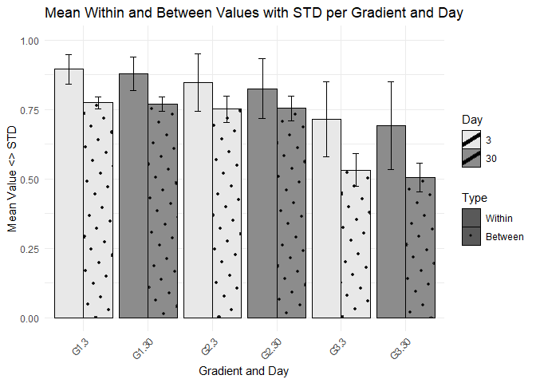

fig3_pcc_ratio_WB
================
Yvonne Serhan
2024-11-05

``` r
library(ggplot2)
library(dplyr)
library(tidyr)
library(lme4)
library(emmeans)
library(ggpattern)
```

``` r
# For Day 3 Data
G1_data_day3_matrix <- as.matrix(G1_data_day3)
diag_values_day3 <- diag(G1_data_day3_matrix)

# Convert diagonal values to a data frame
df_day3 <- data.frame(G1_Day3 = diag_values_day3)

# For Day 30 Data
G1_data_day30_matrix <- as.matrix(G1_data_day30)
diag_values_day30 <- diag(G1_data_day30_matrix)

# Convert diagonal values to a data frame
df_day30 <- data.frame(G1_Day30 = diag_values_day30)


# For Day 3 Data
G2_data_day3_matrix <- as.matrix(G2_data_day3)
diag_values_day3 <- diag(G2_data_day3_matrix)

# Convert diagonal values to a data frame
G2_df_day3 <- data.frame(G2_Day3 = diag_values_day3)

# For Day 30 Data
G2_data_day30_matrix <- as.matrix(G2_data_day30)
diag_values_day30 <- diag(G2_data_day30_matrix)

# Convert diagonal values to a data frame
G2_df_day30 <- data.frame(G2_Day30 = diag_values_day30)


# For Day 3 Data
G3_data_day3_matrix <- as.matrix(G3_data_day3)
diag_values_day3 <- diag(G3_data_day3_matrix)

# Convert diagonal values to a data frame
G3_df_day3 <- data.frame(G3_Day3 = diag_values_day3)

# For Day 30 Data
G3_data_day30_matrix <- as.matrix(G3_data_day30)
diag_values_day30 <- diag(G3_data_day30_matrix)

# Convert diagonal values to a data frame
G3_df_day30 <- data.frame(G3_Day30 = diag_values_day30)


# Combine both data frames into one
final_df <- cbind(df_day3, df_day30,G2_df_day3,G2_df_day30,G3_df_day3,G3_df_day30)
```

``` r
# Optionally, save the final data frame as a CSV file
write.csv(final_df, file = "diagonal_values_data.csv", row.names = FALSE)
```

``` r
# Function to calculate the within and mean between values for each subject
calculate_subject_ratios <- function(matrix) {
  matrix <- as.matrix(matrix)
  
  n <- nrow(matrix)
  within_subject <- diag(matrix)
  
  between_subject_means <- numeric(n)
  
  for (i in 1:n) {
    row_values <- matrix[i, -i]
    column_values <- matrix[-i, i]
    between_subject_means[i] <- mean(c(row_values, column_values))
  }
  
  # Return a data frame with within, between, and Subject identifier
  return(data.frame(Subject = paste0("Sub", 1:n), within = within_subject, between = between_subject_means))
}
```

``` r
# Define a list of gradients and days for iteration
gradients <- c("G1", "G2", "G3")
days <- c(3, 30)

# Initialize an empty list to store results for each gradient and day
ratios_list <- list()

# Loop over each gradient and day to calculate and store the ratios
for (gradient in gradients) {
  for (day in days) {
    # Create the variable name dynamically (e.g., G1_data_day3)
    data_name <- paste0(gradient, "_data_day", day)
    
    # Use get() to access the data by name and calculate ratios
    ratio <- calculate_subject_ratios(get(data_name))
    
    # Add the gradient and day information
    ratio <- mutate(ratio, Gradient = gradient, Day = day)
    
    # Append to the list
    ratios_list[[paste0(gradient, "_day", day)]] <- ratio
  }
}
```

``` r
# Combine all ratios into a single data frame
ratios_df <- bind_rows(ratios_list)
```

``` r
# Combine all ratios into a single data frame
ratios_df <- bind_rows(ratios_list)

# Calculate the within/between ratios
ratios_df <- ratios_df %>%
  mutate(ratio = within / between)
```

``` r
# Calculate mean and standard error per Gradient and Day
summary_df <- ratios_df %>%
  group_by(Gradient, Day) %>%
  summarize(
    mean_within = mean(within, na.rm = TRUE),
    std_within = sd(within, na.rm = TRUE) , # Standard Error for 'within'
    mean_between = mean(between, na.rm = TRUE),
    std_between = sd(between, na.rm = TRUE) # Standard Error for 'between'
  )
```

    ## `summarise()` has grouped output by 'Gradient'. You can override using the
    ## `.groups` argument.

``` r
# Reshape the data for plotting
plot_df <- summary_df %>%
  pivot_longer(
    cols = c(mean_within, mean_between, std_within, std_between), 
    names_to = c("Metric", "Type"), 
    names_sep = "_", 
    values_to = "Value"
  ) %>%
  pivot_wider(
    names_from = Metric, 
    values_from = Value
  ) %>%
  mutate(Type = ifelse(Type == "within", "Within", "Between"))
```

``` r
# Reorder the x-axis for the desired order
plot_df <- plot_df %>%
  mutate(x_order = interaction(Gradient, Day)) %>%
  arrange(Day, Gradient) %>%
  mutate(x_order = factor(x_order, levels = unique(x_order)))  # Ensure the order is preserved

plot_df$Type = factor(plot_df$Type, levels = c('Within','Between'))

# Create the updated bar plot
p<-ggplot(plot_df, aes(x = x_order, y = mean, fill = as.factor(Day), pattern = Type)) +
  geom_bar_pattern(
    stat = "identity", 
    position = position_dodge(width = 0.9),   # Adds space between bars
    pattern_fill = "black", 
    pattern_density = 0.2,
    color = "black",                         # Adds a black border to bars
    size = 0.3                               # Thickness of the black border
  ) +
  geom_errorbar(
    aes(ymin = mean - std, ymax = mean + std),
    position = position_dodge(width = 0.9), 
    width = 0.2
  ) +
  scale_fill_manual(values = c("3" = "#e8e8e8", "30" = "#8c8c8c", "1" = "#c0c0c0")) +
  scale_pattern_manual(values = c("Within" = "none", "Between" = "circle")) +
  labs(x = "Gradient and Day", y = "Mean Value <> STD", fill = "Day", pattern = "Type") +
  ggtitle("Mean Within and Between Values with STD per Gradient and Day") +
  theme_minimal() +
  theme(
    axis.text.x = element_text(angle = 45, hjust = 1),  # Rotate x-axis labels for readability
    legend.position = "right"
  )+
  ylim(0,1)
```

    ## Warning: Using `size` aesthetic for lines was deprecated in ggplot2 3.4.0.
    ## ℹ Please use `linewidth` instead.
    ## This warning is displayed once every 8 hours.
    ## Call `lifecycle::last_lifecycle_warnings()` to see where this warning was
    ## generated.

``` r
ggsave(file="gradient_within_between_mean_STD.png", p, width=8, height=5, dpi=400)
p
```

<!-- -->

``` r
# Create the violin plot with overlaid boxplots
plot <- ggplot(ratios_df, aes(x = factor(Gradient), y = ratio, fill = factor(Day))) +
  geom_violin(trim = FALSE, scale = "width") +
  geom_boxplot(width = 0.2, position = position_dodge(width = 0.9), alpha = 0.7, outlier.shape = NA) +
  labs(title = "Comparison of Gradient Ratios by Day",
       x = "Gradient",
       y = "Gradient Ratio") +
  theme_minimal() +
  scale_fill_manual(values = c("3" = "#e8e8e8", "30" = "#8c8c8c")) +
  theme(legend.title = element_blank(), panel.grid.major = element_line(color = "gray60"),  # Change major grid color
    panel.grid.minor = element_line(color = "gray60"))   # Change minor grid color)
#ggsave(file="gradient_within_between_ratio.png", plot, width=8, height=5, dpi=400)
plot
```

<!-- -->

``` r
aov_gradient <- aov(ratio ~ Gradient, data = ratios_df)
summary(aov_gradient)
```

    ##              Df Sum Sq Mean Sq F value Pr(>F)    
    ## Gradient      2  1.970  0.9850   47.43 <2e-16 ***
    ## Residuals   177  3.676  0.0208                   
    ## ---
    ## Signif. codes:  0 '***' 0.001 '**' 0.01 '*' 0.05 '.' 0.1 ' ' 1

``` r
# Run the repeated measures ANOVA
anova_result <- aov(ratio ~ Gradient * Day + Error(Subject/(Gradient*Day)), data = ratios_df)

# Summary of the ANOVA
summary(anova_result)
```

    ## 
    ## Error: Subject
    ##           Df Sum Sq Mean Sq F value Pr(>F)
    ## Residuals 29   1.22 0.04205               
    ## 
    ## Error: Subject:Gradient
    ##           Df Sum Sq Mean Sq F value   Pr(>F)    
    ## Gradient   2  1.970  0.9850   52.11 1.11e-13 ***
    ## Residuals 58  1.096  0.0189                     
    ## ---
    ## Signif. codes:  0 '***' 0.001 '**' 0.01 '*' 0.05 '.' 0.1 ' ' 1
    ## 
    ## Error: Subject:Day
    ##           Df Sum Sq  Mean Sq F value Pr(>F)
    ## Day        1 0.0039 0.003908   0.258  0.615
    ## Residuals 29 0.4386 0.015123               
    ## 
    ## Error: Subject:Gradient:Day
    ##              Df Sum Sq Mean Sq F value Pr(>F)
    ## Gradient:Day  2 0.0221 0.01103   0.714  0.494
    ## Residuals    58 0.8955 0.01544

``` r
# Get the estimated marginal means for the Gradient factor
emm_gradients <- emmeans(anova_result, ~ Gradient)

# Perform pairwise comparisons for the Gradient factor with Tukey adjustment
pairwise_comparisons <- pairs(emm_gradients, adjust = "tukey")

# View the pairwise comparison results
pairwise_comparisons
```

    ##  contrast estimate     SE  df t.ratio p.value
    ##  G1 - G2    0.0522 0.0374 115   1.395  0.3470
    ##  G1 - G3   -0.2199 0.0374 115  -5.879  <.0001
    ##  G2 - G3   -0.2721 0.0374 115  -7.274  <.0001
    ## 
    ## Results are averaged over the levels of: Day 
    ## P value adjustment: tukey method for comparing a family of 3 estimates
