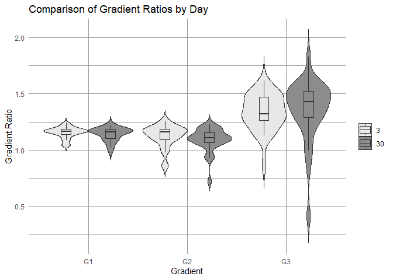

fig3_pcc_ratio_WB
================
Yvonne Serhan
2024-11-05

``` r
library(ggplot2)
library(dplyr)
library(tidyr)
library(lme4)
library(emmeans)
```

``` r
# Function to calculate the within and mean between values for each subject
calculate_subject_ratios <- function(matrix) {
  matrix <- as.matrix(matrix)
  
  n <- nrow(matrix)
  within_subject <- diag(matrix)
  
  between_subject_means <- numeric(n)
  
  for (i in 1:n) {
    row_values <- matrix[i, -i]
    column_values <- matrix[-i, i]
    between_subject_means[i] <- mean(c(row_values, column_values))
  }
  
  # Return a data frame with within, between, and Subject identifier
  return(data.frame(Subject = paste0("Sub", 1:n), within = within_subject, between = between_subject_means))
}
```

``` r
# Define a list of gradients and days for iteration
gradients <- c("G1", "G2", "G3")
days <- c(3, 30)

# Initialize an empty list to store results for each gradient and day
ratios_list <- list()

# Loop over each gradient and day to calculate and store the ratios
for (gradient in gradients) {
  for (day in days) {
    # Create the variable name dynamically (e.g., G1_data_day3)
    data_name <- paste0(gradient, "_data_day", day)
    
    # Use get() to access the data by name and calculate ratios
    ratio <- calculate_subject_ratios(get(data_name))
    
    # Add the gradient and day information
    ratio <- mutate(ratio, Gradient = gradient, Day = day)
    
    # Append to the list
    ratios_list[[paste0(gradient, "_day", day)]] <- ratio
  }
}
```

``` r
# Combine all ratios into a single data frame
ratios_df <- bind_rows(ratios_list)

# Calculate the within/between ratios
ratios_df <- ratios_df %>%
  mutate(ratio = within / between)
```

``` r
# Create the violin plot with overlaid boxplots
plot <- ggplot(ratios_df, aes(x = factor(Gradient), y = ratio, fill = factor(Day))) +
  geom_violin(trim = FALSE, scale = "width") +
  geom_boxplot(width = 0.2, position = position_dodge(width = 0.9), alpha = 0.7, outlier.shape = NA) +
  labs(title = "Comparison of Gradient Ratios by Day",
       x = "Gradient",
       y = "Gradient Ratio") +
  theme_minimal() +
  scale_fill_manual(values = c("3" = "#e8e8e8", "30" = "#8c8c8c")) +
  theme(legend.title = element_blank(), panel.grid.major = element_line(color = "gray60"),  # Change major grid color
    panel.grid.minor = element_line(color = "gray60"))   # Change minor grid color)
ggsave(file="gradient_within_between_ratio.png", plot, width=8, height=5, dpi=400)
plot
```

<!-- -->

``` r
aov_gradient <- aov(ratio ~ Gradient, data = ratios_df)
summary(aov_gradient)
```

    ##              Df Sum Sq Mean Sq F value Pr(>F)    
    ## Gradient      2  1.970  0.9850   47.43 <2e-16 ***
    ## Residuals   177  3.676  0.0208                   
    ## ---
    ## Signif. codes:  0 '***' 0.001 '**' 0.01 '*' 0.05 '.' 0.1 ' ' 1

``` r
# Run the repeated measures ANOVA
anova_result <- aov(ratio ~ Gradient * Day + Error(Subject/(Gradient*Day)), data = ratios_df)

# Summary of the ANOVA
summary(anova_result)
```

    ## 
    ## Error: Subject
    ##           Df Sum Sq Mean Sq F value Pr(>F)
    ## Residuals 29   1.22 0.04205               
    ## 
    ## Error: Subject:Gradient
    ##           Df Sum Sq Mean Sq F value   Pr(>F)    
    ## Gradient   2  1.970  0.9850   52.11 1.11e-13 ***
    ## Residuals 58  1.096  0.0189                     
    ## ---
    ## Signif. codes:  0 '***' 0.001 '**' 0.01 '*' 0.05 '.' 0.1 ' ' 1
    ## 
    ## Error: Subject:Day
    ##           Df Sum Sq  Mean Sq F value Pr(>F)
    ## Day        1 0.0039 0.003908   0.258  0.615
    ## Residuals 29 0.4386 0.015123               
    ## 
    ## Error: Subject:Gradient:Day
    ##              Df Sum Sq Mean Sq F value Pr(>F)
    ## Gradient:Day  2 0.0221 0.01103   0.714  0.494
    ## Residuals    58 0.8955 0.01544

``` r
# Get the estimated marginal means for the Gradient factor
emm_gradients <- emmeans(anova_result, ~ Gradient)

# Perform pairwise comparisons for the Gradient factor with Tukey adjustment
pairwise_comparisons <- pairs(emm_gradients, adjust = "tukey")

# View the pairwise comparison results
pairwise_comparisons
```

    ##  contrast estimate     SE  df t.ratio p.value
    ##  G1 - G2    0.0522 0.0374 115   1.395  0.3470
    ##  G1 - G3   -0.2199 0.0374 115  -5.879  <.0001
    ##  G2 - G3   -0.2721 0.0374 115  -7.274  <.0001
    ## 
    ## Results are averaged over the levels of: Day 
    ## P value adjustment: tukey method for comparing a family of 3 estimates
