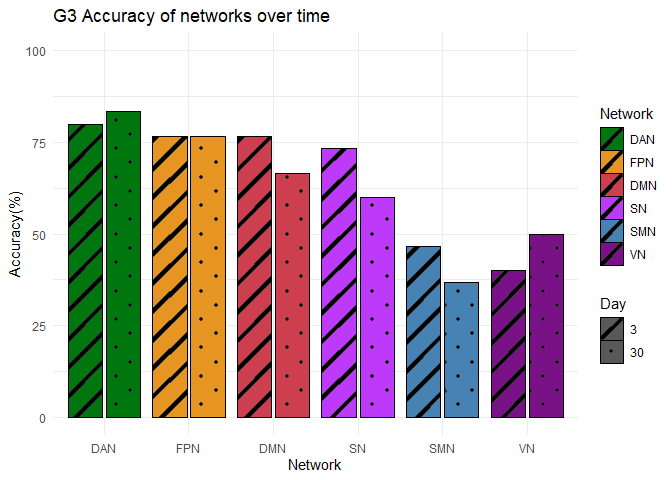
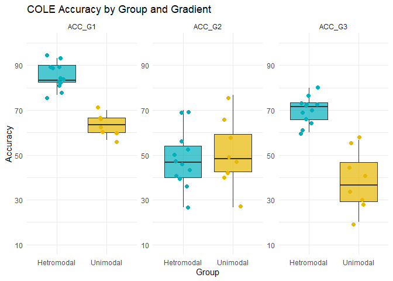

Figure 4 Networks Gradients Accuracy
================

``` r
library(ggsci)
library(cowplot)
library(ggthemes)
library(ggridges)
library(philentropy)
library(dplyr)
library(ggplot2)
library(ggpubr)
library(psych)
library(ICC)
library(lattice)
library(lpSolve)
library(irr)
library(plot.matrix)
library(reshape)
library(plotly)
library(tidyverse)
library(svglite)
library(viridis)
library(stats)
library(ggpattern)
library(plyr)
```

``` r
G1 = read.csv('../Brainspace/G1_results_BS_p_20K_20K_Dan.csv')
#G1 = G1  %>% filter(YeoNets != 'LN')
unique_names = unique(G1$YeoNets)
G1$YeoNets = factor(G1$YeoNets, levels = unique_names)

G2 = read.csv('../Brainspace/G2_results_BS_p_20K_20K_Dan.csv')
#G2 = G2  %>% filter(YeoNets != 'LN')
unique_names = unique(G2$YeoNets)
G2$YeoNets = factor(G2$YeoNets, levels = unique_names)

G3 = read.csv('../Brainspace/G3_results_BS_p_20K_20K_Dan.csv')
#G3 = G3  %>% filter(YeoNets != 'LN')
unique_names = unique(G3$YeoNets)
G3$YeoNets = factor(G3$YeoNets, levels = unique_names)

# List of gradients to process
gradients <- c("G1", "G2", "G3")
```

``` r
cole = read.csv('../G1_results_glasser_cole_parc.csv')
cole_unique_names = unique(cole$cole_name) 
cole_unique_names = cole_unique_names[1:(length(cole_unique_names) - 1)]
cole$cole_name = factor(cole$cole_name, levels = cole_unique_names)
```

``` r
# Create an empty data frame with columns
net_df <- data.frame(Network = character(),
                 Day = integer(),
                 ACC_col = numeric(),
                 ACC_row = numeric(),
                 ACC_both = numeric(),
                 stringsAsFactors = TRUE)

# Loop through each network
for (i in cole_unique_names) {
  # Insert data for each network
  net_df <- rbind(net_df, c(paste0(i),3,0,0,0))
  net_df <- rbind(net_df, c(paste0(i),30,0,0,0))
}
colnames(net_df)<- c("Network","Day","ACC_COL","ACC_ROW","ACC_BOTH")


row_names <- c()  # Replace ... with appropriate names
for (parcel in cole_unique_names){
  current_row_name <- paste(parcel,"ses02", sep = " ")  # Creating a new row name
  row_names <- c(row_names, current_row_name)
  current_row_name <- paste(parcel,"ses10", sep = " ")
  row_names <- c(row_names, current_row_name)
  
  }#end for
```

``` r
# Define a function to calculate accuracy metrics
calculate_accuracy <- function(matrix_df) {
  AccuRow <- 0
  AccuCol <- 0
  AccuBoth <- 0
  for (k in 1:ncol(matrix_df)) {
    row <- matrix_df[k,]
    col <- matrix_df[,k]
    colMax <- which.max(col)
    rowMax <- which.max(row)
    if (rowMax == k) AccuRow <- AccuRow + 1
    if (colMax == k) AccuCol <- AccuCol + 1
    if (colMax == rowMax && rowMax == k) AccuBoth <- AccuBoth + 1
  }
  list(AccuRow = (AccuRow / 30) * 100, AccuCol = (AccuCol / 30) * 100, AccuBoth = (AccuBoth / 30) * 100)
}

# Define a function to create and save plot
create_save_plot <- function(data, x_label, y_label, title, filename) {
  p <- ggplot(data, aes(x = variable, y = y, fill = value)) +
    geom_tile() +
    scale_fill_gradientn(limits = c(0, 0.95), colours = c("white", "lightblue", "red")) +
    labs(x = x_label, y = y_label, title = title) +
    theme(
      plot.title = element_text(face = 'bold', size = 10, hjust = 0.5),
      axis.text.x = element_text(size = 8, angle = 45, hjust = 1),
      axis.text.y = element_text(size = 8, angle = 45, hjust = 1)
    )
  ggsave(filename, p, path = "cole/", width = 6, height = 5, dpi = 400)
  ggplotly(p) # Convert to interactive plot if needed
}
```

``` r
# Outer loop for each gradient
for (gradient in gradients) {
  gradient_data <- get(gradient)
  gradient_data$cole_name = cole$cole_name
  for (parcel in cole_unique_names){
    Ses1 = (gradient_data%>% filter(cole_name == parcel))[,2:31]
    Ses2 = (gradient_data%>% filter(cole_name == parcel))[,32:61]
    Ses10 = (gradient_data%>% filter(cole_name == parcel))[,62:91] 
  
    
    # Initialize ICC matrices
    iccMatrix02 <- matrix(ncol = ncol(Ses1), nrow = ncol(Ses2))
    iccMatrix10 <- matrix(ncol = ncol(Ses1), nrow = ncol(Ses10))
    
    # Calculate ICC for each pair of columns
    for (i in 1:ncol(Ses2)) {
      for (j in 1:ncol(Ses1)) {
        v_ses2 <- cor(Ses1[, i], Ses2[, j], method = 'pearson')
        v_ses10 <- cor(Ses1[, i], Ses10[, j], method = 'pearson')
        iccMatrix02[i, j] <- v_ses2
        iccMatrix10[i, j] <- v_ses10
      }
    }
    
    
    # Convert matrices to data frames
    matrix_df_2 <- as.data.frame(iccMatrix02)
    matrix_df_10 <- as.data.frame(iccMatrix10)
    subjName <- paste0("Sub", 1:30)
    colnames(matrix_df_2) <- subjName; rownames(matrix_df_2) <- subjName
    colnames(matrix_df_10) <- subjName; rownames(matrix_df_10) <- subjName
  
    y<- colnames(matrix_df_2)
    x<- rownames(matrix_df_2)
    y<-rep(y, times = 30)
    
    # Melt data for ggplot
    df_2 <- melt(matrix_df_2); df_10 <- melt(matrix_df_10)
    
    df_2$y <- factor(y,subjName)
    df_10$y <- factor(y,subjName)
  
    
    # Plot and save matrices with gradient name in title and filename
    plot_title_10 <- paste("COLE PCC", parcel, gradient, "Day 1 vs Day 30", sep = "-")
    filename_10 <- paste(parcel, gradient,  "New_PCC_SES01-10_20k_20k.png", sep = "_")
    create_save_plot(df_10, "Day 30", "Day 1", plot_title_10, filename_10)
    
    plot_title_2 <- paste("COLE PCC", parcel, gradient, "Day 1 vs Day 3", sep = "-")
    filename_2 <- paste(parcel, gradient,  "New_PCC_SES01-2_20k_20k.png", sep = "_")
    create_save_plot(df_2, "Day 3", "Day 1", plot_title_2, filename_2)
    
    # Calculate and print accuracy metrics for Day 3 and Day 30
    accuracy_2 <- calculate_accuracy(matrix_df_2)
    accuracy_10 <- calculate_accuracy(matrix_df_10)
    
    #print(accuracy_2$AccuBoth); print(accuracy_2$AccuRow); print(accuracy_2$AccuCol)
    #print(accuracy_10$AccuBoth); print(accuracy_10$AccuRow); print(accuracy_10$AccuCol)
    
    # Update net_df with accuracy metrics
    
    net_df[ net_df$Network == parcel & net_df$Day == 3, c("ACC_ROW", "ACC_COL","ACC_BOTH")] <- unlist(accuracy_2)
    net_df[net_df$Network == parcel & net_df$Day == 30 , c("ACC_ROW", "ACC_COL","ACC_BOTH")] <- unlist(accuracy_10)
    
    # Save matrices as CSV files with gradient name in filename
    write.csv(matrix_df_2, paste(parcel, gradient, "New_PCC_SES01-2_20k_20k_COLE.csv", sep = "_"), row.names = FALSE)
    write.csv(matrix_df_10, paste(parcel,gradient, "New_PCC_SES01-10_20k_20k_COLE.csv", sep = "_"), row.names = FALSE)
    
    write.csv(net_df, paste(gradient, "New_PCC_COLE_ACC.csv", sep = "_"), row.names = FALSE)
     }
}
```

``` r
library(dplyr)
# Read the CSV file
data <- read.csv("G3_PCC_YEO_ACC.csv")
data$Network = factor(data$Network, levels = c('DAN','FPN','DMN','SN','SMN','VN'))
data$Day <- factor(data$Day, levels = c("3", "30"))

# Define custom colors
custom_colors <- c('#00760E','#E69422', '#CD3E4E','#BE3AFA', '#4682B4', '#781286')
```

``` r
# Create the plot
plot <- ggplot(data, aes(x = Network, y = Accuracy, fill = Network)) +
  geom_col_pattern(
    aes(pattern = Day),
    colour = "black",
    pattern_fill = "black",
    pattern_angle = 45,
    pattern_density = 0.2,
    pattern_spacing = 0.05,
    position = position_dodge2(preserve = 'single'),
  ) +
  labs(title = "G3 Accuracy of networks over time",
       x = "Network",
       y = "Accuracy(%)")+
    scale_fill_manual(values = custom_colors) +
    scale_color_manual(values = custom_colors) +
    scale_y_continuous(limits=c(0, 100), breaks=seq(0,100,by=25))+
  theme_minimal()
ggsave(file="Yeo_ACC_G3_barplot.png", plot, width=6, height=5, dpi=400)
```

    ## Warning: The `scale_name` argument of `discrete_scale()` is deprecated as of ggplot2
    ## 3.5.0.
    ## This warning is displayed once every 8 hours.
    ## Call `lifecycle::last_lifecycle_warnings()` to see where this warning was
    ## generated.

``` r
plot
```

<!-- -->

``` r
cole_networks <- c("Dorsal-Attention","Frontoparietal","Default","Cingulo-Opercular","Language","Posterior-Multimodal","Ventral-Multimodal","Orbito-Affective","Somatomotor","Visual1","Visual2","Auditory")


cole_data <- read.csv("G3_PCC_COLE_ACC.csv")
cole_data$Network = factor(cole_data$Network, levels = cole_networks)
cole_data$Day <- as.factor(cole_data$Day)

cole_custom_colors <- c(
  "#00FF00",  # Dorsal-Attention
  "#FFFF00",  # Frontoparietal
  "#FF0000",  # Default
  "#990099",  # Cingulo-Opercular
  "#009A9A",  # Language
  "#B15928",  # Posterior-Multimodal
  "#FF9C00",  # Ventral-Multimodal
  "#417C00",  # Orbito-Affective
  "#00FFFF",  # Somatomotor
  "#0000FF",  # Visual1
  "#6400FF",  # Visual2
  "#F93DFB"   # Auditory
)
```

``` r
# Create the plot
plot <- ggplot(cole_data, aes(x = Network, y = Accuracy, fill = Network)) +
  geom_col_pattern(
    aes(pattern = Day),
    colour = "black",
    pattern_fill = "black",
    pattern_angle = 45,
    pattern_density = 0.2,
    pattern_spacing = 0.05,
    position = position_dodge2(preserve = 'single'),
  ) +
  labs(title = "G3 Accuracy of Cole networks over time",
       x = "Cole Networks",
       y = "Accuracy(%)")+
    scale_fill_manual(values = cole_custom_colors) +
  scale_color_manual(values = cole_custom_colors) +
  scale_y_continuous(limits=c(0, 100), breaks=seq(0,100,by=25))+
  theme_minimal()+
  theme(plot.title = element_text(face='bold', size=10, hjust=0.5),axis.text.x = element_text(size=8, angle = 45, hjust = 1))
ggsave(file="Cole_Acc_barplot_G3.png", plot, width=8, height=6, dpi=400)
plot
```

<!-- -->

``` r
# Load necessary libraries
library(ggplot2)
library(dplyr)
library(tidyr)

df <- read.csv("COLE_NETWORKS_PCC_ACC_ALL_G.csv")
df = df %>% filter(Group != 'Out')

df_long <- df %>%
  pivot_longer(cols = starts_with("ACC"), # Only select G1_ACC, G2_ACC, G3_ACC
               names_to = "Gradient", 
               values_to = "Accuracy")

# Check if it worked
head(df_long)
```

    ## # A tibble: 6 × 5
    ##   Network Group        Day Gradient Accuracy
    ##   <chr>   <chr>      <int> <chr>       <dbl>
    ## 1 Default Hetromodal     3 ACC_G1       93.3
    ## 2 Default Hetromodal     3 ACC_G2       40  
    ## 3 Default Hetromodal     3 ACC_G3       73.3
    ## 4 Default Hetromodal    30 ACC_G1       76.7
    ## 5 Default Hetromodal    30 ACC_G2       36.7
    ## 6 Default Hetromodal    30 ACC_G3       60

``` r
# Make sure Group is a factor
df_long$Group <- as.factor(df_long$Group)

# Summary for Bar Plot
df_summary <- df_long %>%
  group_by(Group, Gradient) %>%
  summarise(Mean_ACC = mean(Accuracy),
            SD_ACC = sd(Accuracy),
            .groups = 'drop')
```

``` r
plot<- ggplot(df_long, aes(x = Group, y = Accuracy, fill = Group)) +
  geom_boxplot(alpha = 0.7) +
  geom_jitter(shape = 16, position = position_jitter(0.2), size = 2, aes(color = Group)) +
  facet_wrap(~ Gradient, scales = "free_y") +
  labs(title = "COLE Accuracy by Group and Gradient", y = "Accuracy", x = "Group") +
  theme_minimal() +
  theme(legend.position = "none") +
  scale_fill_manual(values = c("#00AFBB", "#E7B800")) +
  scale_color_manual(values = c("#00AFBB", "#E7B800"))+
  scale_y_continuous(limits=c(10, 100), breaks=seq(10,100,by=20))
ggsave("COLE_PCC_ACC_MEAN_ALL_G.png", plot, width=12, height=6)
plot
```

<!-- -->

``` r
df = df %>% filter(Group != 'Out')
# Assuming your data is in a dataframe called 'df'
# Convert group to a factor for better control
df$Group <- as.factor(df$Group)

# Step 1: Checking normality per group
# Shapiro-Wilk test for G1_ACC in each group
shapiro_hetro_G1 <- shapiro.test(df %>% filter(Group == "Hetromodal") %>% pull(ACC_G1))
shapiro_uni_G1 <- shapiro.test(df %>% filter(Group == "Unimodal") %>% pull(ACC_G1))

# Similarly for G2_ACC and G3_ACC
shapiro_hetro_G2 <- shapiro.test(df %>% filter(Group == "Hetromodal") %>% pull(ACC_G2))
shapiro_uni_G2 <- shapiro.test(df %>% filter(Group == "Unimodal") %>% pull(ACC_G2))

shapiro_hetro_G3 <- shapiro.test(df %>% filter(Group == "Hetromodal") %>% pull(ACC_G3))
shapiro_uni_G3 <- shapiro.test(df %>% filter(Group == "Unimodal") %>% pull(ACC_G3))

# Step 2: T-test or Wilcoxon test depending on normality

# Assuming normality holds, we do a t-test
t_test_G1 <- t.test(ACC_G1 ~ Group, data = df)
t_test_G2 <- t.test(ACC_G2 ~ Group, data = df)
t_test_G3 <- t.test(ACC_G3 ~ Group, data = df)

# If the normality assumption does not hold, use Wilcoxon test (non-parametric)
wilcox_test_G1 <- wilcox.test(ACC_G1 ~ Group, data = df)
```

    ## Warning in wilcox.test.default(x = DATA[[1L]], y = DATA[[2L]], ...): cannot
    ## compute exact p-value with ties

``` r
wilcox_test_G2 <- wilcox.test(ACC_G2 ~ Group, data = df)
```

    ## Warning in wilcox.test.default(x = DATA[[1L]], y = DATA[[2L]], ...): cannot
    ## compute exact p-value with ties

``` r
wilcox_test_G3 <- wilcox.test(ACC_G3 ~ Group, data = df)
```

    ## Warning in wilcox.test.default(x = DATA[[1L]], y = DATA[[2L]], ...): cannot
    ## compute exact p-value with ties

``` r
# Print the results
t_test_G1
```

    ## 
    ##  Welch Two Sample t-test
    ## 
    ## data:  ACC_G1 by Group
    ## t = 9.5141, df = 17.743, p-value = 2.177e-08
    ## alternative hypothesis: true difference in means between group Hetromodal and group Unimodal is not equal to 0
    ## 95 percent confidence interval:
    ##  17.09358 26.79531
    ## sample estimates:
    ## mean in group Hetromodal   mean in group Unimodal 
    ##                 85.27778                 63.33333

``` r
t_test_G2
```

    ## 
    ##  Welch Two Sample t-test
    ## 
    ## data:  ACC_G2 by Group
    ## t = -0.37446, df = 12.977, p-value = 0.7141
    ## alternative hypothesis: true difference in means between group Hetromodal and group Unimodal is not equal to 0
    ## 95 percent confidence interval:
    ##  -16.92598  11.92598
    ## sample estimates:
    ## mean in group Hetromodal   mean in group Unimodal 
    ##                 48.33333                 50.83333

``` r
t_test_G3
```

    ## 
    ##  Welch Two Sample t-test
    ## 
    ## data:  ACC_G3 by Group
    ## t = 6.212, df = 9.1106, p-value = 0.0001487
    ## alternative hypothesis: true difference in means between group Hetromodal and group Unimodal is not equal to 0
    ## 95 percent confidence interval:
    ##  20.15629 43.17704
    ## sample estimates:
    ## mean in group Hetromodal   mean in group Unimodal 
    ##                 70.00000                 38.33333

``` r
# If using Wilcoxon tests
wilcox_test_G1
```

    ## 
    ##  Wilcoxon rank sum test with continuity correction
    ## 
    ## data:  ACC_G1 by Group
    ## W = 96, p-value = 0.0002232
    ## alternative hypothesis: true location shift is not equal to 0

``` r
wilcox_test_G2
```

    ## 
    ##  Wilcoxon rank sum test with continuity correction
    ## 
    ## data:  ACC_G2 by Group
    ## W = 43, p-value = 0.7272
    ## alternative hypothesis: true location shift is not equal to 0

``` r
wilcox_test_G3
```

    ## 
    ##  Wilcoxon rank sum test with continuity correction
    ## 
    ## data:  ACC_G3 by Group
    ## W = 96, p-value = 0.0002307
    ## alternative hypothesis: true location shift is not equal to 0

``` r
shapiro_hetro_G1
```

    ## 
    ##  Shapiro-Wilk normality test
    ## 
    ## data:  df %>% filter(Group == "Hetromodal") %>% pull(ACC_G1)
    ## W = 0.90014, p-value = 0.1593

``` r
shapiro_hetro_G2
```

    ## 
    ##  Shapiro-Wilk normality test
    ## 
    ## data:  df %>% filter(Group == "Hetromodal") %>% pull(ACC_G2)
    ## W = 0.9487, p-value = 0.6181

``` r
shapiro_hetro_G3
```

    ## 
    ##  Shapiro-Wilk normality test
    ## 
    ## data:  df %>% filter(Group == "Hetromodal") %>% pull(ACC_G3)
    ## W = 0.92769, p-value = 0.3563
