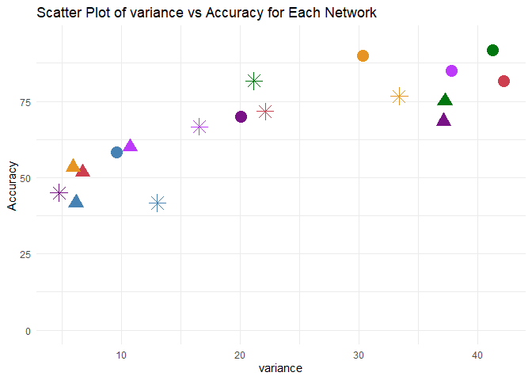
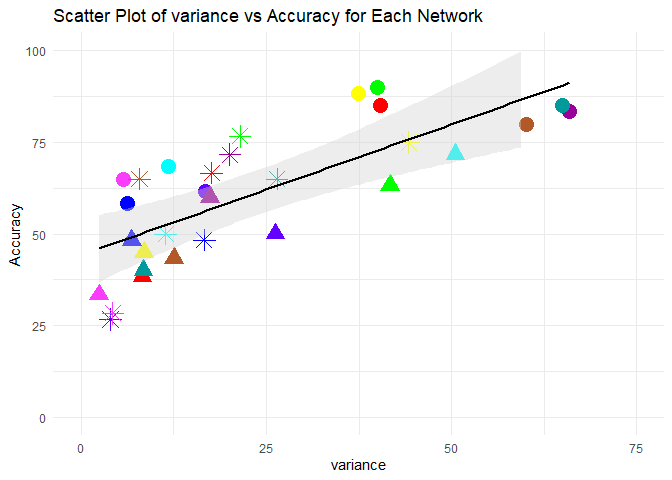

Figure 5 Networks Gradients Range
================

``` r
library(philentropy)
library(entropy)
library(ggsci)
library(cowplot)
library(ggthemes)
library(ggridges)
library(philentropy)
library(dplyr)
library(ggplot2)
library(ggpubr)
library(psych)
library(ICC)
library(lattice)
library(lpSolve)
library(irr)
library(plot.matrix)
library(reshape)
library(plotly)
library(tidyverse)
library(svglite)
library(viridis)
library(ReX)
```

``` r
# Function to calculate variability metrics
calculate_variability <- function(data_vector) {
  # Variance
  variance <- var(data_vector)
  
  # Standard Deviation
  std_dev <- sd(data_vector)
  
  # Interquartile Range (IQR)
  iqr <- IQR(data_vector)
  
  # Range
  range_values <- range(data_vector)
  range_val <- diff(range_values)
  
  # Mean Absolute Deviation (MAD)
  mad_val <- mean(abs(data_vector - mean(data_vector)))
  
  return(list(
    variance = variance,
    std_dev = std_dev,
    iqr = iqr,
    range = range_val,
    mad = mad_val
  ))
}
```

Yeo Networks Analysis

``` r
G1 = read.csv('../Brainspace/G1_results_BS_p_20K_20K_Dan.csv')
G1 = G1 %>% filter(YeoNets != 'LN')
unique_names = unique(G1$YeoNets)
G1$YeoNets = factor(G1$YeoNets, levels = unique_names)

G2 = read.csv('../Brainspace/G2_results_BS_p_20K_20K_Dan.csv')
G2 = G2 %>% filter(YeoNets != 'LN')
unique_names = unique(G2$YeoNets)
G2$YeoNets = factor(G2$YeoNets, levels = unique_names)

G3 = read.csv('../Brainspace/G3_results_BS_p_20K_20K_Dan.csv')
G3 = G3 %>% filter(YeoNets != 'LN')
unique_names = unique(G3$YeoNets)
G3$YeoNets = factor(G3$YeoNets, levels = unique_names)
```

``` r
data = G1

data$G1= rowMeans(G1[,2:91])
data$G2= rowMeans(G2[,2:91])
data$G3= rowMeans(G3[,2:91])
```

``` r
# Create an empty data frame with columns
net_df <- data.frame(Network = character(),
                 variance = numeric(),
                 std_dev = numeric(),
                 iqr = numeric(),
                 range = numeric(),
                 mad = numeric(),
                 mean_acc = numeric(),
                 stringsAsFactors = TRUE)

# Loop through each network
for (i in unique_names) {
  # Insert data for each network
  net_df <- rbind(net_df, c(paste0(i),0,0,0,0,0,0))
}
colnames(net_df)<- c("Network","variance","std_dev","iqr","range","mad","mean_acc")
```

``` r
for (parcel in unique_names){
  data_for_analysis = (data%>% filter(YeoNets == parcel))
  variability_metrics <- calculate_variability(data_for_analysis$G3)
    # Update the net_df dataframe with the calculated variance
  net_df <- net_df %>%
    mutate(variance = ifelse(Network == parcel, variability_metrics[["variance"]], variance))
    net_df <- net_df %>%
    mutate(std_dev = ifelse(Network == parcel, variability_metrics[["std_dev"]], std_dev))
    net_df <- net_df %>%
    mutate(iqr = ifelse(Network == parcel, variability_metrics[["iqr"]], iqr))
        net_df <- net_df %>%
    mutate(range = ifelse(Network == parcel, variability_metrics[["range"]], range))
     net_df <- net_df %>%
    mutate(mad = ifelse(Network == parcel, variability_metrics[["mad"]], mad))
}
```

``` r
acc_data <- read.csv("G3_PCC_YEO_ACC.csv")
```

``` r
# Calculate the average accuracy for each network
average_accuracy <- acc_data %>%
  group_by(Network) %>%
  summarise(Mean_Accuracy = mean(Accuracy))

# Print the result
print(average_accuracy)
```

    ## # A tibble: 6 × 2
    ##   Network Mean_Accuracy
    ##   <chr>           <dbl>
    ## 1 DAN              81.7
    ## 2 DMN              71.7
    ## 3 FPN              76.7
    ## 4 SMN              41.7
    ## 5 SN               66.7
    ## 6 VN               45

``` r
net_df <- net_df %>%
  left_join(average_accuracy, by = "Network") %>%
  mutate(mean_acc = Mean_Accuracy) %>%
  select(-Mean_Accuracy) 
net_df$Network = factor(net_df$Network, levels = c('DMN','FPN','SN','DAN','VN','SMN'))

head(net_df)
```

    ##   Network         variance          std_dev              iqr            range
    ## 1     DMN 22.1178516278542 4.70296200578467 6.56721857430788 25.3653894013292
    ## 2     FPN 33.3903716085505 5.77844024011242 8.99640344141718 25.8232894527519
    ## 3      SN   16.55896271803 4.06927053881036 5.37835356602259 21.4496524155018
    ## 4     SMN 13.0116829029787 3.60717103877523 5.31508253062433   20.46236704663
    ## 5      VN 4.73533417222078 2.17608229904588 1.62971045021714 18.6350058054288
    ## 6     DAN 21.1647767933091 4.60051918736452 6.86558775887111 23.1258055009603
    ##                mad mean_acc
    ## 1  3.7736466854875 71.66667
    ## 2 4.84671603203517 76.66667
    ## 3 3.25608334618792 66.66667
    ## 4 2.96598624996119 41.66667
    ## 5 1.48246969242064 45.00000
    ## 6 3.81741980582261 81.66667

``` r
all_var_acc <- read.csv("variance_acc_yeo.csv")
#all_var_acc$Network =factor(all_var_acc$Network,levels=YeoNets)
all_var_acc$Network =factor(all_var_acc$Network,levels=c('DMN','FPN','SN','DAN','VN','SMN'))

head(all_var_acc)
```

    ##   Gradient Network variance mean_acc
    ## 1       G1     DMN 42.21448 81.66667
    ## 2       G1     FPN 30.32214 90.00000
    ## 3       G1      SN 37.77378 85.00000
    ## 4       G1     SMN  9.56666 58.33333
    ## 5       G1      VN 20.05518 70.00000
    ## 6       G1     DAN 41.25360 91.66667

``` r
correlation <- cor(as.numeric(all_var_acc$mean_acc), as.numeric(all_var_acc$variance))
print(paste("Correlation coefficient:", correlation))
```

    ## [1] "Correlation coefficient: 0.845229847241503"

``` r
# Perform correlation test
cor_test <- cor.test(as.numeric(all_var_acc$mean_acc), as.numeric(all_var_acc$variance))
print(cor_test)
```

    ## 
    ##  Pearson's product-moment correlation
    ## 
    ## data:  as.numeric(all_var_acc$mean_acc) and as.numeric(all_var_acc$variance)
    ## t = 6.3265, df = 16, p-value = 1.007e-05
    ## alternative hypothesis: true correlation is not equal to 0
    ## 95 percent confidence interval:
    ##  0.6249878 0.9408347
    ## sample estimates:
    ##       cor 
    ## 0.8452298

``` r
# Create scatter plots for each network
plot <- ggplot(all_var_acc, aes(x = as.numeric(variance), y = as.numeric(mean_acc), color = Network, shape = Gradient)) +
  geom_point(size=5) +
  labs(title = "Scatter Plot of variance vs Accuracy for Each Network",
       x = "variance",
       y = "Accuracy") +
  theme_minimal() +
  scale_fill_manual(values = c('#CD3E4E','#E69422', '#BE3AFA', '#00760E', '#781286', '#4682B4')) +
  scale_color_manual(values = c('#CD3E4E','#E69422', '#BE3AFA', '#00760E', '#781286', '#4682B4')) +
  scale_shape_manual(values = c("G1" = 16, "G2" = 17, "G3" = 8)) +
  scale_y_continuous(limits=c(0, 95), breaks=seq(0,75,by=25))+
  theme(legend.position = "none")
  # Ensures y-axis is treated as continuous
  ggsave(file="Yeo_variance_accuracy_correlation_new_fixed_limits.png", plot, width=5, height=5, dpi=400)
plot
```

<!-- -->

Cole Networks Analysis

``` r
G1 = read.csv('../Brainspace/G1_results_BS_p_20K_20K_Dan.csv')
unique_names = unique(G1$YeoNets)
G1$YeoNets = factor(G1$YeoNets, levels = unique_names)

G2 = read.csv('../Brainspace/G2_results_BS_p_20K_20K_Dan.csv')
unique_names = unique(G2$YeoNets)
G2$YeoNets = factor(G2$YeoNets, levels = unique_names)

G3 = read.csv('../Brainspace/G3_results_BS_p_20K_20K_Dan.csv')
unique_names = unique(G3$YeoNets)
G3$YeoNets = factor(G3$YeoNets, levels = unique_names)
```

``` r
data = G1

data$G1= rowMeans(G1[,2:91])
data$G2= rowMeans(G2[,2:91])
data$G3= rowMeans(G3[,2:91])

cole = read.csv('../G1_results_glasser_cole_parc.csv')
unique_names = unique(cole$cole_name)
cole$cole_name = factor(cole$cole_name, levels = unique_names)
unique_names
```

    ##  [1] "Default"              "Cingulo-Opercular"    "Frontoparietal"      
    ##  [4] "Somatomotor"          "Visual2"              "Visual1"             
    ##  [7] "Language"             "Dorsal-Attention"     "Orbito-Affective"    
    ## [10] "Posterior-Multimodal" "Ventral-Multimodal"   "Auditory"            
    ## [13] ""

``` r
cole_networks <- c("Dorsal-Attention","Frontoparietal","Default","Cingulo-Opercular","Language","Posterior-Multimodal","Ventral-Multimodal","Orbito-Affective","Visual2", "Somatomotor","Visual1","Auditory")
data$cole = cole$cole_name
data = data %>% filter(cole != '')
data$cole = factor(data$cole, levels = cole_networks)
```

``` r
# Create an empty data frame with columns
net_df <- data.frame(Network = character(),
                 variance = numeric(),
                 std_dev = numeric(),
                 iqr = numeric(),
                 range = numeric(),
                 mad = numeric(),
                 mean_acc = numeric(),
                 stringsAsFactors = TRUE)

# Loop through each network
for (i in cole_networks) {
  # Insert data for each network
  net_df <- rbind(net_df, c(paste0(i),0,0,0,0,0,0))
}
colnames(net_df)<- c("Network","variance","std_dev","iqr","range","mad","mean_acc")
```

``` r
for (parcel in cole_networks){
  data_for_analysis = (data%>% filter(cole == parcel))
  variability_metrics <- calculate_variability(data_for_analysis$G3)
    # Update the net_df dataframe with the calculated variance
  net_df <- net_df %>%
    mutate(variance = ifelse(Network == parcel, variability_metrics[["variance"]], variance))
    net_df <- net_df %>%
    mutate(std_dev = ifelse(Network == parcel, variability_metrics[["std_dev"]], std_dev))
    net_df <- net_df %>%
    mutate(iqr = ifelse(Network == parcel, variability_metrics[["iqr"]], iqr))
        net_df <- net_df %>%
    mutate(range = ifelse(Network == parcel, variability_metrics[["range"]], range))
     net_df <- net_df %>%
    mutate(mad = ifelse(Network == parcel, variability_metrics[["mad"]], mad))
}
```

``` r
acc_data <- read.csv("G3_PCC_COLE_ACC.csv")
```

``` r
# Calculate the average accuracy for each network
average_accuracy <- acc_data %>%
  group_by(Network) %>%
  summarise(Mean_Accuracy = mean(Accuracy))

# Print the result
print(average_accuracy)
```

    ## # A tibble: 12 × 2
    ##    Network              Mean_Accuracy
    ##    <chr>                        <dbl>
    ##  1 Auditory                      28.3
    ##  2 Cingulo-Opercular             71.7
    ##  3 Default                       66.7
    ##  4 Dorsal-Attention              76.7
    ##  5 Frontoparietal                75  
    ##  6 Language                      65  
    ##  7 Orbito-Affective              16.7
    ##  8 Posterior-Multimodal          65  
    ##  9 Somatomotor                   48.3
    ## 10 Ventral-Multimodal            18.3
    ## 11 Visual1                       26.7
    ## 12 Visual2                       50

``` r
net_df <- net_df %>%
  left_join(average_accuracy, by = "Network") %>%
  mutate(mean_acc = Mean_Accuracy) %>%
  select(-Mean_Accuracy) 
net_df$Network = factor(net_df$Network, levels = cole_networks)

head(net_df)
```

    ##                Network         variance          std_dev              iqr
    ## 1     Dorsal-Attention 21.4240764376167 4.62861495888529 6.62424992128137
    ## 2       Frontoparietal 44.1845451494043  6.6471456392503 9.77815226166865
    ## 3              Default 17.5868730302244 4.19367059152533 6.11421980344936
    ## 4    Cingulo-Opercular 20.0655902269906  4.4794631628121 6.19517277628628
    ## 5             Language 26.4477246142539 5.14273512970034 6.38906693978027
    ## 6 Posterior-Multimodal 7.85851699661961 2.80330465640458 2.88071557544861
    ##              range              mad mean_acc
    ## 1 24.3363427690216 3.77396523030854 76.66667
    ## 2  28.625248356253 5.48877211754758 75.00000
    ## 3  25.191149819664 3.39347627158593 66.66667
    ## 4 25.3021911144203 3.63429462856912 71.66667
    ## 5 25.0216414582125 4.03400964430889 65.00000
    ## 6  14.670008995278 2.09271125822893 65.00000

``` r
# Calculate the correlation
correlation <- cor(as.numeric(net_df$mean_acc), as.numeric(net_df$variance))
print(paste("Correlation coefficient:", correlation))
```

    ## [1] "Correlation coefficient: 0.77139942500347"

``` r
cole_all_var_acc <- read.csv("cole_variance_acc.csv")
cole_all_var_acc$Network =factor(cole_all_var_acc$Network,levels=cole_networks)
head(cole_all_var_acc)
```

    ##   Gradient              Network variance mean_acc
    ## 1       G1     Dorsal-Attention 40.04148 90.00000
    ## 2       G1       Frontoparietal 37.38539 88.33333
    ## 3       G1              Default 40.38383 85.00000
    ## 4       G1    Cingulo-Opercular 65.89165 83.33333
    ## 5       G1             Language 64.99089 85.00000
    ## 6       G1 Posterior-Multimodal 60.11883 80.00000

``` r
# Calculate the correlation
correlation <- cor(as.numeric(cole_all_var_acc$mean_acc), as.numeric(cole_all_var_acc$variance))
print(paste("Correlation coefficient:", correlation))
```

    ## [1] "Correlation coefficient: 0.746696944721688"

``` r
# Perform correlation test
cor_test <- cor.test(as.numeric(cole_all_var_acc$mean_acc), as.numeric(cole_all_var_acc$variance))
print(cor_test)
```

    ## 
    ##  Pearson's product-moment correlation
    ## 
    ## data:  as.numeric(cole_all_var_acc$mean_acc) and as.numeric(cole_all_var_acc$variance)
    ## t = 6.5457, df = 34, p-value = 1.7e-07
    ## alternative hypothesis: true correlation is not equal to 0
    ## 95 percent confidence interval:
    ##  0.5540883 0.8634211
    ## sample estimates:
    ##       cor 
    ## 0.7466969

``` r
cole_custom_colors <- c(
  "#00FF00",  # Dorsal-Attention
  "#FFFF00",  # Frontoparietal
  "#FF0000",  # Default
  "#990099",  # Cingulo-Opercular
  "#009A9A",  # Language
  "#B15928",  # Posterior-Multimodal
  "#FF9C00",  # Ventral-Multimodal
  "#417C00",  # Orbito-Affective
  "#00FFFF",  # Somatomotor
  "#0000FF",  # Visual1
  "#6400FF",  # Visual2
  "#F93DFB"   # Auditory
)
# Create scatter plots for each network
plot<- ggplot(cole_all_var_acc, aes(x = as.numeric(variance), y = as.numeric(mean_acc), color = Network, shape = Gradient)) +
  geom_point(size=5) +
  labs(title = "Scatter Plot of variance vs Accuracy for Each Network",
       x = "variance",
       y = "Accuracy") +
  theme_minimal() +
    scale_fill_manual(values = cole_custom_colors) +
  scale_color_manual(values = cole_custom_colors) +
  scale_shape_manual(values = c("G1" = 16, "G2" = 17, "G3" = 8)) +
  scale_x_continuous(limits=c(0, 75), breaks=seq(0,75,by=25))+
  scale_y_continuous(limits=c(0, 90), breaks=seq(0,75,by=25))+
  theme(legend.position = "none")
  ggsave(file="COLE_variance_num_accuracy_correlation_new_with_fixed_limits_V2.png", plot, width=6, height=5, dpi=400)
plot
```

<!-- -->
