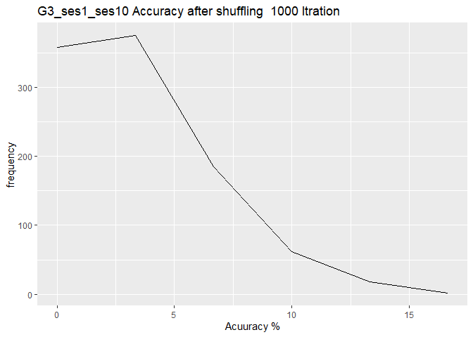

Permutation Test
================

``` r
library(ggsci)
library(cowplot)
library(ggthemes)
library(ggridges)
library(philentropy)
library(dplyr)
library(ggplot2)
library(ggpubr)
library(psych)
library(ICC)
library(lattice)
library(lpSolve)
library(irr)
library(plot.matrix)
library(reshape)
library(plotly)
library(tidyverse)
library(svglite)
library(viridis)
```

``` r
matrix10_df<- read.csv('G3_New_PCC_SES01-10_20k_20k.csv')
matrix2_df<- read.csv('G3_New_PCC_SES01-2_20k_20k.csv')
```

``` r
calculateICCAccu_per_sub<-function(ICC_Matrix,i,k){
  
  AccuRow=0
  AccuCol=0
  AccuBoth=0
  row<- ICC_Matrix[i,]
  col<- ICC_Matrix[,i]
  colMax<-which.max(col)
  rowMax<-which.max(row)
  if(rowMax== k){
    AccuRow=AccuRow+1
  }
  if(colMax== k){
    AccuCol=AccuCol+1
  }
  if (colMax == rowMax && colMax== k)
  AccuBoth = AccuBoth+1
  AccuBoth = (AccuBoth/30)*100
  AccuRow = (AccuRow/30)*100
  AccuCol = (AccuCol/30)*100
  
  accu_list <- list("Row" = AccuRow, "Col" = AccuCol, "Both" = AccuBoth)
  return(accu_list)
  
}
```

``` r
shuffel_num= 1000

iccMatrix02<- matrix(ncol=30, nrow=30)
iccMatrix10<- matrix(ncol=30, nrow=30)
#create data frame with two columns
accu_df <- data.frame(matrix(ncol = 3, nrow = shuffel_num))
colnames(accu_df) <-c("row", "col","both")

for(i in 1:shuffel_num){
  round_accu <- data.frame(matrix(ncol = 3, nrow = ncol(iccMatrix10)))
  colnames(round_accu) <-c("row", "col","both")
  
  for (j in 1:ncol(iccMatrix02)){
 
  
    correct_k <- sample.int(30, 1)
    correct_k
    
    ICC_Matrix = matrix10_df
    Accu <-calculateICCAccu_per_sub(ICC_Matrix,j,correct_k)
    
    round_accu[j,]<- Accu
    
  }
  accu_df[i,]<-  colSums(round_accu[,])
  
}
```

``` r
data_to_use <- accu_df %>%
  dplyr::group_by(row) %>%
  dplyr::summarise(frequency = dplyr::n())
head(data_to_use)
```

    ## # A tibble: 6 × 2
    ##     row frequency
    ##   <dbl>     <int>
    ## 1  0          358
    ## 2  3.33       375
    ## 3  6.67       185
    ## 4 10           62
    ## 5 13.3         18
    ## 6 16.7          2

``` r
p<- ggplot(data_to_use, aes(x=row,y=frequency))+
  geom_line()+
  ggtitle(paste("G3_ses1_ses10 Accuracy after shuffling  1000 Itration", sep=" "))+xlab("Acuuracy %")+ylab("frequency")
p 
```

<!-- -->

``` r
ggsave(file="1000_random_G3_ses1_ses10_New_PCC_row.png", p, width=6, height=5, dpi=400)
```
